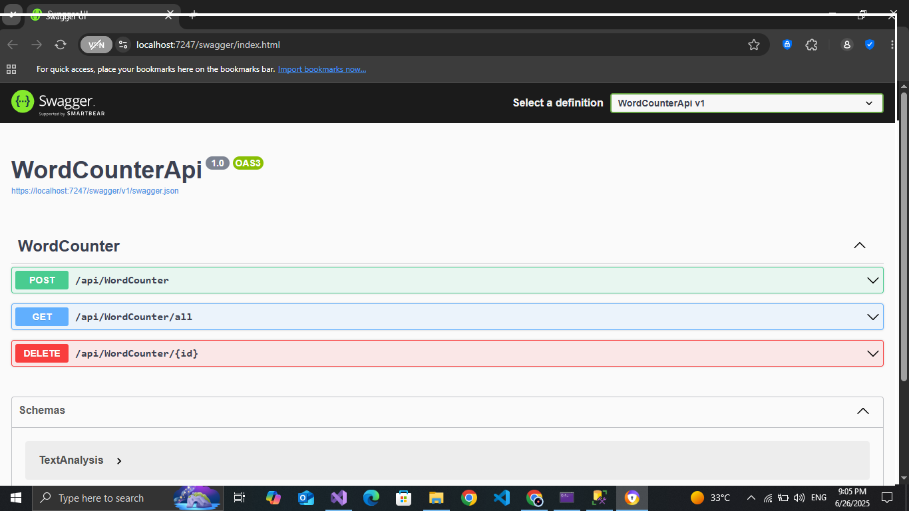
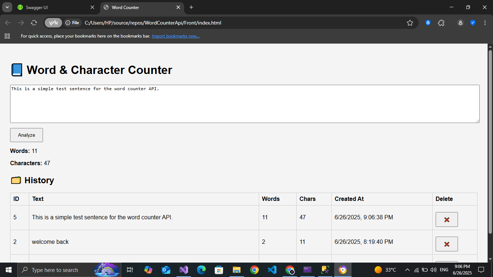

# 📘 Word Counter API

A simple ASP.NET Core Web API project that counts the number of words and characters in a given text.  
It also stores analysis history and provides a basic HTML interface.

---

## 🚀 Features

- ✅ Analyze word and character count via API
- ✅ Store text analysis history in SQL Server
- ✅ HTML frontend to interact with the API
- ✅ Delete individual analyses
- ✅ View history in table format

---

## 🛠️ Technologies Used

- ASP.NET Core Web API (.NET 8)
- Entity Framework Core
- SQL Server (LocalDb)
- HTML 
- Git & GitHub

---
## 📸 Screenshots

### 🔹 API Interface (Swagger)


### 🔹 HTML Frontend


## 📦 How to Run

### ▶️ Run API
```bash
dotnet run
